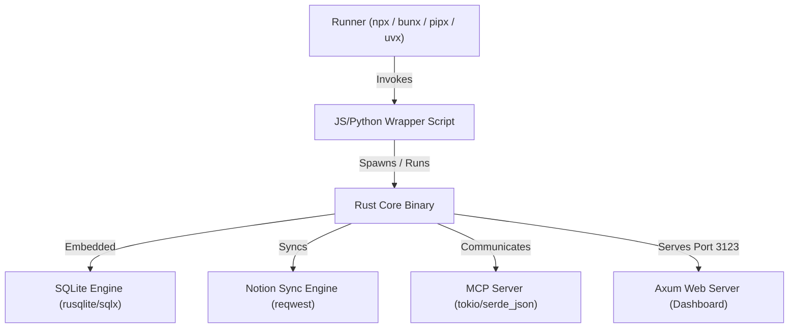

# PRD: Rust Backend-Server Logic Overhaul

## 1. Executive Summary
Engram Notion MCP currently uses a dual-stack setup with Node.js/Bun and Python implementations. While this guarantees runtime choice for users, maintaining parity between the two environments requires substantial duplicated work, introduces versioning synchronization overhead, and is prone to bugs.

This document details the requirements and architecture for overhauling the backend server. We will rewrite the core logic in **Rust**, unifying the SQLite database management, Notion API synchronization, MCP protocol engine, and background HTTP dashboard server into a single, high-performance binary. To preserve the local running capabilities via `bunx / npx` and `uvx / pipx`, we will build a minimal transpiled/wrapper packaging layer.

---

## 2. Goals & Key Objectives
- **Single Source of Truth:** Eliminate the Node.js/Bun and Python dual-stack code duplication. Write all core server logic once in Rust.
- **Native Speed & Efficiency:** Lower memory footprint (<10MB idle RAM vs ~60MB+ for Node/Python) and achieve near-zero startup delay.
- **Zero-Dependency Native Execution:** Compile to native binaries for key targets (macOS arm64/x64, Linux arm64/x64, Windows x64).
- **Maintain Existing Runner Ecosystem:** Ensure developers can still run the server locally using:
  - `npx engram-notion-mcp` / `bunx engram-notion-mcp`
  - `pipx run engram-notion-mcp` / `uvx engram-notion-mcp`

---

## 3. Architecture & Tech Stack

### Core Technologies
1. **Language:** Rust (Stable)
2. **Asynchronous Runtime:** `tokio`
3. **MCP Protocol:** Custom lightweight JSON-RPC 2.0 parser or `modelcontextprotocol/rust-sdk` over standard input/output.
4. **Database:** SQLite (`rusqlite` or `sqlx` in SQLite mode) with FTS5 enabled.
5. **HTTP Server:** `axum` + `tower-http` for static asset serving and REST endpoints.
6. **Notion Client:** `reqwest` or `hyper` with `serde` for serialization.

---

## 4. Detailed Feature Specifications

### 4.1 MCP Server Engine
- Implement standard JSON-RPC 2.0 protocol over `stdin`/`stdout`.
- Expose the exact same tools as the current Bun/Python servers:
  - `create_memory` / `read_memories`
  - `query_graph` / `add_node_relation`
  - `sync_notion_pages`
- All diagnostic and status logs **MUST** be printed to `stderr` to avoid breaking the MCP stdio protocol.

### 4.2 SQLite Database & Migration Engine
- Compile and build with FTS5 support.
- Automatically execute migrations on startup.
- Maintain identical tables: `sessions`, `memories`, `nodes`, `edges`, `memory_nodes`, `triage_status`, and `memories_fts`.
- Maintain identical SQLite triggers for automated FTS5 indexing (`memories_ai`, `memories_ad`, `memories_au`).

### 4.3 Background HTTP Dashboard Server
- Port reuse and redirection protocol:
  - Attempt to listen on port `3123`.
  - Perform self-health check: if port is bound by another instance of `engram-notion-mcp`, bypass booting HTTP server and exit/connect via stdio.
  - If unbound, serve API endpoints:
    - `GET /health`
    - `GET /api/metrics`
    - `GET /api/graph`
    - `GET /api/memories?q=...`
    - `POST /api/memories/correct`
    - `POST /api/compaction`
- Serve compiled static SPA assets (HTML, CSS, JS) from an embedded/compiled-in public folder using `rust-embed` or similar.

---

## 5. Wrapper Packaging Layer (Local Run Support)

To support seamless local execution without requiring users to manually compile Rust code, the project will distribute wrapper packages.

### 5.1 JS / npm Wrapper (`bunx` & `npx`)
We will use the **Optional Dependencies** strategy (similar to `esbuild` or `tailwind` CLI packages).
- **Core Package (`engram-notion-mcp`):** Contains a simple Node.js wrapper script `bin/cli.js`.
- **Platform-Specific Packages:** e.g. `engram-notion-mcp-darwin-arm64`, `engram-notion-mcp-linux-x64` containing the compiled binary for that environment.
- When `npx engram-notion-mcp` is invoked, npm installs the core package along with the single optional dependency corresponding to the user's current platform.
- The `bin/cli.js` simply calls `execa` or `child_process.spawn` on the platform-specific native binary, forwarding all arguments, stdin, and stdout.

### 5.2 Python / PyPI Wrapper (`uvx` & `pipx`)
We will package the Rust binary using **Maturin** with binary bindings.
- Configure `pyproject.toml` with `maturin` build-system.
- In `Cargo.toml`, set `[tool.maturin] bindings = "bin"`.
- Maturin compiles the binary and packages it directly as the executable inside target wheels.
- Cross-compile wheels for macOS, Linux, and Windows using GitHub Actions.
- When `uvx run engram-notion-mcp` or `pipx run engram-notion-mcp` is invoked, PyPI resolves the matching platform wheel, installs the precompiled binary, and runs it natively.

---

## 6. Migration Plan & Strategy
1. **Phase 1: Rust Core Setup & DB Engine**
   - Create a clean Cargo library layout.
   - Implement SQLite migrations and connection pools.
2. **Phase 2: Notion API Client & Dream Compaction**
   - Port Notion client integrations.
   - Implement the JSON-RPC tool router.
3. **Phase 3: Axum HTTP Dashboard Server**
   - Set up Axum routes and integrate index/static serving via `rust-embed`.
4. **Phase 4: Packaging and CI/CD**
   - Configure Maturin for PyPI wheels.
   - Configure Optional Dependencies structure for npm/yarn.
   - Create Github Actions pipeline to cross-compile binaries and publish releases.
