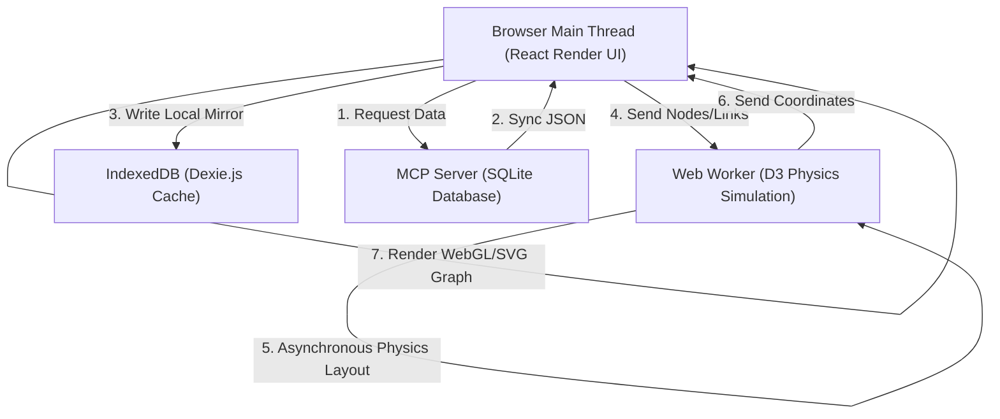

# Engram Notion MCP - Product Vision & Frontend Engineering Roadmap

This document outlines the performance model, structural plans, and features designed for the interactive browser-based Memory Dashboard (Phase 2 and Phase 3).

---

## 1. Zero-Blocking Threading Model (Performance Design)

To ensure the local web dashboard remains responsive even as SQLite memories and knowledge graph edges scale to thousands of records, we implement a decoupled frontend performance model:

### 1. Web Workers for D3 Graph Layouts
* **The Problem:** Force-directed network graphs require iterative coordinate physics loops (forces, bounds, collisions). Running these calculation steps directly on the browser's main thread locks layout rendering, stalls user inputs (input delay), and reduces frame rates (jank).
* **The Solution:** Offload the simulation loop to a background [d3-layout.worker.ts](file:///Users/sammy/workstation/workflow-ideas/better-notion-mcp/node/mcp-ui/src/workers/d3-layout.worker.ts). The main thread passes nodes and connections to the Web Worker, which executes the force layout iterations in parallel and publishes finalized coordinate arrays back to the main canvas view.

### 2. IndexedDB Caching via Dexie.js
* **The Problem:** Querying the MCP background SQLite server on every keypress, drag, or filter triggers network fetch overhead, creating noticeable UI lag.
* **The Solution:** Establish an in-browser mirror database using **IndexedDB** configured with [local-db.ts](file:///Users/sammy/workstation/workflow-ideas/better-notion-mcp/node/mcp-ui/src/services/local-db.ts). On initial load, the client syncs recent memories, entities, and relations to IndexedDB. Keyword filters, range scans, and graph queries resolve locally inside the browser in under 1ms.

### 3. Service Workers for Offline/0ms Layout Recall
* Service Workers cache the compiled React shell, CSS themes, and JS assets locally. When the user opens the dashboard, the page resolves in 0ms directly from cache, avoiding wait times for the local server port to read files.

---

## 2. Feature Roadmap

### Phase 2: Embedded UI Monorepo Setup (Current Phase)
* **Goal:** Decouple compilation pipelines and replace legacy static dashboard assets with a React SPA.
* **Milestones:**
  * Restructure `node/` into workspaces.
  * Configure Vite and Tailwind v4 to output builds directly to the server core `public/` directory.
  * Scaffold Dexie.js schemas, layout workers, and components.
  * Update Bun and Node HTTP routing engines to support serving compiled frontend structures.

### Phase 3: Hallucination Pruning & "Dreaming Loops"
* **Goal:** Introduce autonomous/manual fact compaction and correction cycles.
* **Core Concepts:**
  * **The Dream Loop:** A periodic background analysis cycle (either user-triggered or scheduled during idle server time) where the LLM reads stored database facts, flags duplicates, resolves contradictions, and compacts fragmented memories.
  * **Interactive Triage:** An expanded dashboard interface letting users manually flag facts for deletion, merge related nodes, and view contradictions.
  * **Weekly Reminder Scheduler:** Custom notification triggers sent to Slack, Telegram, or terminal prompts alerting the user when memory cleanups are recommended.
